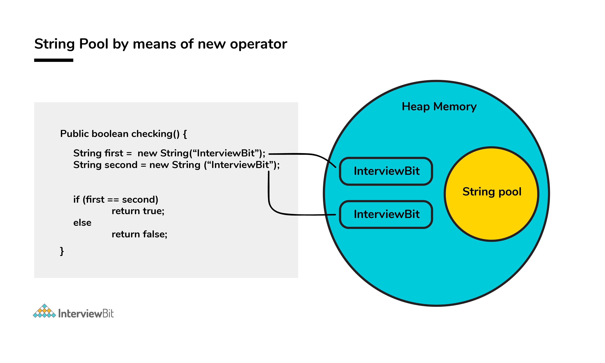
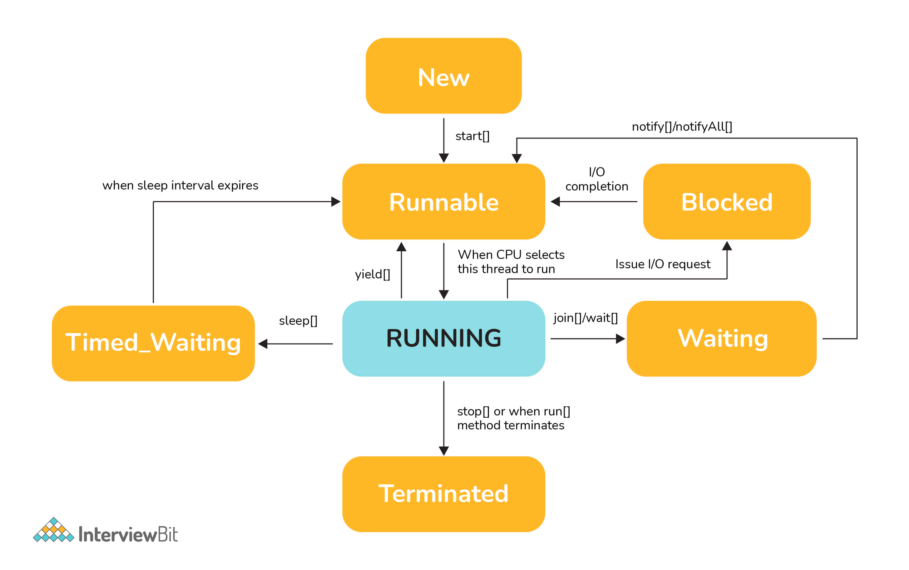

### Java Advanced Interview Questions

#### 1. Although inheritance is a popular OOPs concept, it is less advantageous than composition. Explain.

Inheritance lags behind composition in the following scenarios:

Multiple-inheritance is not possible in Java. Classes can only extend from one superclass.

In cases where multiple functionalities are required, for example - to read and write information into the file, the
pattern of composition is preferred. The writer, as well as reader functionalities, can be made use of by considering
them as the private members. Composition assists in attaining high flexibility and prevents breaking of encapsulation.

Unit testing is possible with composition and not inheritance. When a developer wants to test a class composing a
different class, then Mock Object can be created for signifying the composed class to facilitate testing. This technique
is not possible with the help of inheritance as the derived class cannot be tested without the help of the superclass in
inheritance.

The loosely coupled nature of composition is preferable over the tightly coupled nature of inheritance. Let’s take an
example:

```
package comparison;
public class Top {
public int start() {
return 0;
}
}
class Bottom extends Top {
public int stop() {
return 0;
}
}
```

In the above example, inheritance is followed. Now, some modifications are done to the Top class like this:

```
public class Top {
public int start() {
return 0;
}
public void stop() {
}
}
```

If the new implementation of the Top class is followed, a compile-time error is bound to occur in the Bottom class.
Incompatible return type is there for the Top.stop() function. Changes have to be made to either the Top or the Bottom
class to ensure compatibility. However, the composition technique can be utilized to solve the given problem:

```
class Bottom {
Top par = new Top();
public int stop() {
par.start();
par.stop();
return 0;
}
}
```

#### 2. How is the creation of a String using new() different from that of a literal?

When a String is formed as a literal with the assistance of an assignment operator, it makes its way into the String
constant pool so that String Interning can take place. This same object in the heap will be referenced by a different
String if the content is the same for both of them.

```
public bool checking() {
String first = "InterviewBit";
String second = "InterviewBit";
if (first == second)
return true;
else
return false;
}
```

The checking() function will return true as the same content is referenced by both the variables.

Conversely, when a String formation takes place with the help of a new() operator, interning does not take place. The
object gets created in the heap memory even if the same content object is present.

```
public bool checking() {
String first = new String("InterviewBit");
String second = new String("InterviewBit");
if (first == second)
return true;
else
return false;
}
```

The checking() function will return false as the same content is not referenced by both the variables.


#### 3. Is exceeding the memory limit possible in a program despite having a garbage collector?

Yes, it is possible for the program to go out of memory in spite of the presence of a garbage collector. Garbage
collection assists in recognizing and eliminating those objects which are not required in the program anymore, in order
to free up the resources used by them.

In a program, if an object is unreachable, then the execution of garbage collection takes place with respect to that
object. If the amount of memory required for creating a new object is not sufficient, then memory is released for those
objects which are no longer in the scope with the help of a garbage collector. The memory limit is exceeded for the
program when the memory released is not enough for creating new objects.

Moreover, exhaustion of the heap memory takes place if objects are created in such a manner that they remain in the
scope and consume memory. The developer should make sure to dereference the object after its work is accomplished.
Although the garbage collector endeavors its level best to reclaim memory as much as possible, memory limits can still
be exceeded.

Let’s take a look at the following example:

```
List<String> example = new LinkedList<String>();
while(true){
example.add(new String("Memory Limit Exceeded"));
}
```

#### 4. Why is synchronization necessary? Explain with the help of a relevant example.

Concurrent execution of different processes is made possible by synchronization. When a particular resource is shared
between many threads, situations may arise in which multiple threads require the same shared resource.

Synchronization assists in resolving the issue and the resource is shared by a single thread at a time. Let’s take an
example to understand it more clearly. For example, you have a URL and you have to find out the number of requests made
to it. Two simultaneous requests can make the count erratic.

No synchronization:

```
package anonymous;
public class Counting {
private int increase_counter;
public int increase() {
increase_counter = increase_counter + 1;
return increase_counter;
}
}
```

If a thread Thread1 views the count as 10, it will be increased by 1 to 11. Simultaneously, if another thread Thread2
views the count as 10, it will be increased by 1 to 11. Thus, inconsistency in count values takes place because the
expected final value is 12 but the actual final value we get will be 11.

Now, the function increase() is made synchronized so that simultaneous accessing cannot take place.

With synchronization:

```
package anonymous;
public class Counting {
private int increase_counter;
public synchronized int increase() {
increase_counter = increase_counter + 1;
return increase_counter;
}
}
```

If a thread Thread1 views the count as 10, it will be increased by 1 to 11, then the thread Thread2 will view the count
as 11, it will be increased by 1 to 12. Thus, consistency in count values takes place.

#### 5. In the given code below, what is the significance of ... ?

```
public void fooBarMethod(String... variables){
// method code
}
Ability to provide ... is a feature called varargs (variable arguments) which was introduced as part of Java 5.
The function having ... in the above example indicates that it can receive multiple arguments of the datatype String.
For example, the fooBarMethod can be called in multiple ways and we can still have one method to process the data as shown below:
fooBarMethod("foo", "bar");
fooBarMethod("foo", "bar", "boo");
fooBarMethod(new String[]{"foo", "var", "boo"});
public void myMethod(String... variables){
for(String variable : variables){
// business logic
}
}
```

#### 6. Can you explain the Java thread lifecycle? Java thread life cycle is as follows:

New – When the instance of the thread is created and the start() method has not been invoked, the thread is considered
to be alive and hence in the NEW state.

Runnable – Once the start() method is invoked, before the run() method is called by JVM, the thread is said to be in
RUNNABLE (ready to run) state. This state can also be entered from the Waiting or Sleeping state of the thread.

Running – When the run() method has been invoked and the thread starts its execution, the thread is said to be in a
RUNNING state.

Non-Runnable (Blocked/Waiting) – When the thread is not able to run despite the fact of its aliveness, the thread is
said to be in a NON-RUNNABLE state. Ideally, after some time of its aliveness, the thread should go to a runnable state.

A thread is said to be in a Blocked state if it wants to enter synchronized code but it is unable to as another thread
is operating in that synchronized block on the same object. The first thread has to wait until the other thread exits
the synchronized block.

A thread is said to be in a Waiting state if it is waiting for the signal to execute from another thread, i.e it waits
for work until the signal is received.

Terminated – Once the run() method execution is completed, the thread is said to enter the TERMINATED step and is
considered to not be alive.


#### 7. What could be the tradeoff between the usage of an unordered array versus the usage of an ordered array?

The main advantage of having an ordered array is the reduced search time complexity of O(log n) whereas the time
complexity in an unordered array is O(n).

The main drawback of the ordered array is its increased insertion time which is O(n) due to the fact that its element
has to reordered to maintain the order of array during every insertion whereas the time complexity in the unordered
array is only O(1).

Considering the above 2 key points and depending on what kind of scenario a developer requires, the appropriate data
structure can be used for implementation.

#### 8. Is it possible to import the same class or package twice in Java and what happens to it during runtime?

It is possible to import a class or package more than once, however, it is redundant because the JVM internally loads
the package or class only once.

#### 9. In case a package has sub packages, will it suffice to import only the main package? e.g. Does importing of com.myMainPackage.* also import com.myMainPackage.mySubPackage.*?

This is a big NO. We need to understand that the importing of the sub-packages of a package needs to be done explicitly.
Importing the parent package only results in the import of the classes within it and not the contents of its
child/sub-packages.

#### 10. Will the finally block be executed if the code System.exit(0) is written at the end of try block?

NO. The control of the program post System.exit(0) is immediately gone and the program gets terminated which is why the
finally block never gets executed.

#### 11. What do you understand by marker interfaces in Java?

Marker interfaces, also known as tagging interfaces are those interfaces that have no methods and constants defined in
them. They are there for helping the compiler and JVM to get run time-related information regarding the objects.

#### 12. Explain the term “Double Brace Initialisation” in Java?

This is a convenient means of initializing any collections in Java. Consider the below example.

```
import java.util.HashSet;
import java.util.Set;

public class IBDoubleBraceDemo{
public static void main(String[] args){
Set<String> stringSets = new HashSet<String>()
{
{
add("set1");
add("set2");
add("set3");
}
};

       doSomething(stringSets);
}
```

```
private static void doSomething(Set<String> stringSets){
System.out.println(stringSets);
}
}
```

In the above example, we see that the stringSets were initialized by using double braces.

The first brace does the task of creating an anonymous inner class that has the capability of accessing the parent
class’s behavior. In our example, we are creating the subclass of HashSet so that it can use the add() method of
HashSet.

The second braces do the task of initializing the instances.

Care should be taken while initializing through this method as the method involves the creation of anonymous inner
classes which can cause problems during the garbage collection or serialization processes and may also result in memory
leaks.

#### 13. Why is it said that the length() method of String class doesn't return accurate results?

The length method returns the number of Unicode units of the String. Let's understand what Unicode units are and what is
the confusion below. We know that Java uses UTF-16 for String representation. With this Unicode, we need to understand
the below two Unicode related terms:

Code Point: This represents an integer denoting a character in the code space.

Code Unit: This is a bit sequence used for encoding the code points. In order to do this, one or more units might be
required for representing a code point.

Under the UTF-16 scheme, the code points were divided logically into 17 planes and the first plane was called the Basic
Multilingual Plane (BMP). The BMP has classic characters - U+0000 to U+FFFF. The rest of the characters- U+10000 to
U+10FFFF were termed as the supplementary characters as they were contained in the remaining planes. The code points
from the first plane are encoded using one 16-bit code unit The code points from the remaining planes are encoded using
two code units. Now if a string contained supplementary characters, the length function would count that as 2 units and
the result of the length() function would not be as per what is expected.

In other words, if there is 1 supplementary character of 2 units, the length of that SINGLE character is considered to
be TWO - Notice the inaccuracy here? As per the java documentation, it is expected, but as per the real logic, it is
inaccurate.

#### 14. What is the output of the below code and why?

```
public class InterviewBit{
public static void main(String[] args)
{
System.out.println('b' + 'i' + 't');
}
}
```

“bit” would have been the result printed if the letters were used in double-quotes (or the string literals). But the
question has the character literals (single quotes) being used which is why concatenation wouldn't occur. The
corresponding ASCII values of each character would be added and the result of that sum would be printed. The ASCII
values of ‘b’, ‘i’, ‘t’ are:

‘b’ = 98 ‘i’ = 105 ‘t’ = 116 98 + 105 + 116 = 319

Hence 319 would be printed.

#### 15. What are the possible ways of making object eligible for garbage collection (GC) in Java?

First Approach: Set the object references to null once the object creation purpose is served.

```
public class IBGarbageCollect {
public static void main (String [] args){
String s1 = "Some String";
// s1 referencing String object - not yet eligible for GC
s1 = null; // now s1 is eligible for GC
}
}
```

Second Approach: Point the reference variable to another object. Doing this, the object which the reference variable was
referencing before becomes eligible for GC.

```
public class IBGarbageCollect {
public static void main(String [] args){
String s1 = "To Garbage Collect";
String s2 = "Another Object";
System.out.println(s1); // s1 is not yet eligible for GC
s1 = s2; // Point s1 to other object pointed by s2
/* Here, the string object having the content  "To Garbage Collect" is not referred by any reference variable. Therefore, it is eligible for GC */
}
}
```

Third Approach: Island of Isolation Approach: When 2 reference variables pointing to instances of the same class, and
these variables refer to only each other and the objects pointed by these 2 variables don't have any other references,
then it is said to have formed an “Island of Isolation” and these 2 objects are eligible for GC.

```
public class IBGarbageCollect {
IBGarbageCollect ib;    
public static void main(String [] str){
IBGarbageCollect ibgc1 = new IBGarbageCollect();
IBGarbageCollect ibgc2 = new IBGarbageCollect();
ibgc1.ib = ibgc2; //ibgc1 points to ibgc2
ibgc2.ib = ibgc1; //ibgc2 points to ibgc1
ibgc1 = null;
ibgc2 = null;
/*
* We see that ibgc1 and ibgc2 objects refer
* to only each other and have no valid
* references- these 2 objects for island of isolcation - eligible for GC
*/
}
}
```