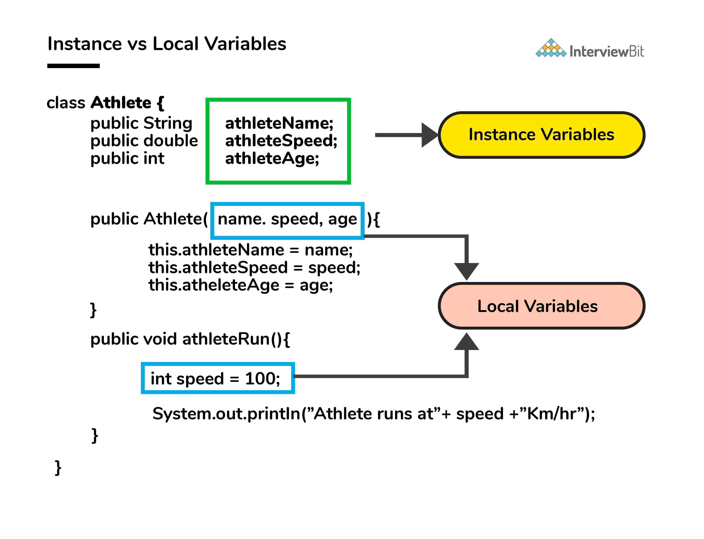
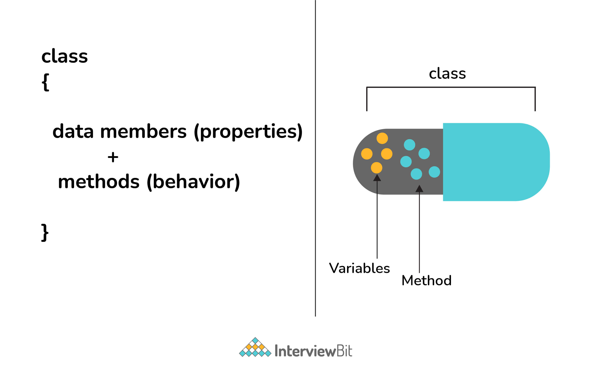
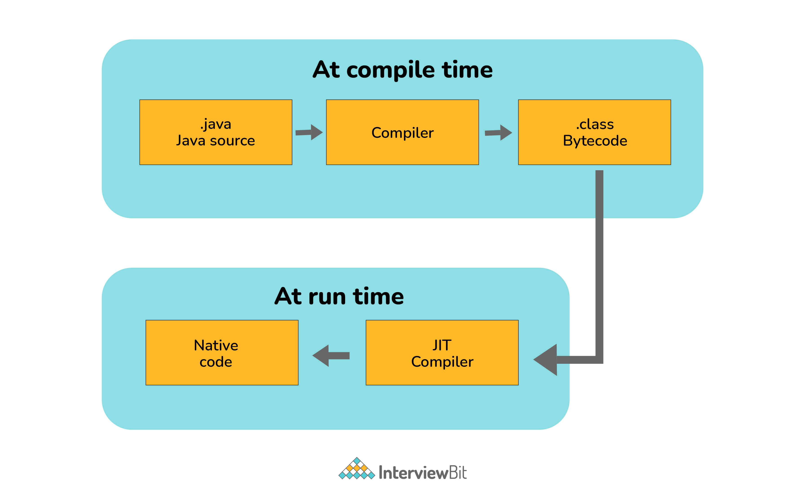
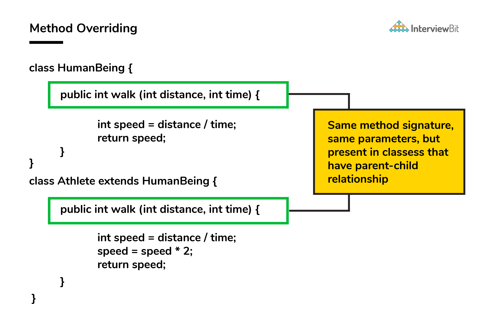

##### Java Basic Interview Questions

#### 1. Why is Java a platform independent language?

Java language was developed in such a way that it does not depend on any hardware or software due to the fact that the
compiler compiles the code and then converts it to platform-independent byte code which can be run on multiple systems.
The only condition to run that byte code is for the machine to have a runtime environment (JRE) installed in it.

#### 2. Why is Java not a pure object oriented language?

Java supports primitive data types - byte, boolean, char, short, int, float, long, and double and hence it is not a pure
object-oriented language.

#### 3. Pointers are used in C/ C++. Why does Java not make use of pointers?

Pointers are quite complicated and unsafe to use by beginner programmers. Java focuses on code simplicity, and the usage
of pointers can make it challenging. Pointer utilization can also cause potential errors. Moreover, security is also
compromised if pointers are used because the users can directly access memory with the help of pointers. Thus, a certain
level of abstraction is furnished by not including pointers in Java. Moreover, the usage of pointers can make the
procedure of garbage collection quite slow and erroneous. Java makes use of references as these cannot be manipulated,
unlike pointers.

#### 4. What do you understand by an instance variable and a local variable?

Instance variables are those variables that are accessible by all the methods in the class. They are declared outside
the methods and inside the class. These variables describe the properties of an object and remain bound to it at any
cost. All the objects of the class will have their copy of the variables for utilization. If any modification is done on
these variables, then only that instance will be impacted by it, and all other class instances continue to remain
unaffected.

Example:

```
class Athlete {
public String athleteName;
public double athleteSpeed;
public int athleteAge;
}
```

Local variables are those variables present within a block, function, or constructor and can be accessed only inside
them. The utilization of the variable is restricted to the block scope. Whenever a local variable is declared inside a
method, the other class methods don’t have any knowledge about the local variable.

Example:

```
public void athlete() {
String athleteName;
double athleteSpeed;
int athleteAge;
}
```

#### 5. What do you mean by data encapsulation?

Data Encapsulation is an Object-Oriented Programming concept of hiding the data attributes and their behaviors in a
single unit. It helps developers to follow modularity while developing software by ensuring that each object is
independent of other objects by having its own methods, attributes, and functionalities. It is used for the security of
the private properties of an object and hence serves the purpose of data hiding.

#### 6. Tell us something about JIT compiler.

JIT stands for Just-In-Time and it is used for improving the performance during run time. It does the task of compiling
parts of byte code having similar functionality at the same time thereby reducing the amount of compilation time for the
code to run. The compiler is nothing but a translator of source code to machine-executable code. But what is special
about the JIT compiler? Let us see how it works:
First, the Java source code (.java) conversion to byte code (.class) occurs with the help of the javac compiler. Then,
the .class files are loaded at run time by JVM and with the help of an interpreter, these are converted to machine
understandable code. JIT compiler is a part of JVM. When the JIT compiler is enabled, the JVM analyzes the method calls
in the .class files and compiles them to get more efficient and native code. It also ensures that the prioritized method
calls are optimized. Once the above step is done, the JVM executes the optimized code directly instead of interpreting
the code again. This increases the performance and speed of the execution.

#### 7. Can you tell the difference between equals() method and equality operator (==) in Java?

```equals()    ==``` <br>
This is a method defined in the Object class. It is a binary operator in Java. This method is used for checking the
equality of contents between two objects as per the specified business logic. This operator is used for comparing
addresses (or references), i.e checks if both the objects are pointing to the same memory location. Note:

In the cases where the equals method is not overridden in a class, then the class uses the default implementation of the
equals method that is closest to the parent class. Object class is considered as the parent class of all the java
classes. The implementation of the equals method in the Object class uses the == operator to compare two objects. This
default implementation can be overridden as per the business logic.

#### 8. How is an infinite loop declared in Java?

Infinite loops are those loops that run infinitely without any breaking conditions. Some examples of consciously
declaring infinite loop is:

```
Using For Loop:
for (;;)
{
   // Business logic
   // Any break logic
}
Using while loop:
while(true){
   // Business logic
   // Any break logic
}
Using do-while loop:
do{
   // Business logic
   // Any break logic
}while(true);
```

#### 9. Briefly explain the concept of constructor overloading

Constructor overloading is the process of creating multiple constructors in the class consisting of the same name with a
difference in the constructor parameters. Depending upon the number of parameters and their corresponding types,
distinguishing of the different types of constructors is done by the compiler.

```
class Hospital {
int variable1, variable2;
double variable3;
public Hospital(int doctors, int nurses) {
 variable1 = doctors;
 variable2 = nurses;
}
public Hospital(int doctors) {
 variable1 = doctors;
}
public Hospital(double salaries) {
 variable3 = salaries
}
}
```

Three constructors are defined here but they differ on the basis of parameter type and their numbers.

#### 10. Comment on method overloading and overriding by citing relevant examples.

In Java, method overloading is made possible by introducing different methods in the same class consisting of the same
name. Still, all the functions differ in the number or type of parameters. It takes place inside a class and enhances
program readability.

The only difference in the return type of the method does not promote method overloading. The following example will
furnish you with a clear picture of it.

```
class OverloadingHelp {
   public int findarea (int l, int b) {
           int var1;
           var1 = l * b;
           return var1;
   }
   public int findarea (int l, int b, int h) {
           int var2;
           var2 = l * b * h;
           return var2;
   }
}
```

Both the functions have the same name but differ in the number of arguments. The first method calculates the area of the
rectangle, whereas the second method calculates the area of a cuboid.

Method overriding is the concept in which two methods having the same method signature are present in two different
classes in which an inheritance relationship is present. A particular method implementation (already present in the base
class) is possible for the derived class by using method overriding. Let’s give a look at this example:

```
class HumanBeing {
       public int walk (int distance, int time) {
               int speed = distance / time;
               return speed;
       }
}
class Athlete extends HumanBeing {
       public int walk(int distance, int time) {
               int speed = distance / time;
               speed = speed * 2;
               return speed;
       }
}
```

Both class methods have the name walk and the same parameters, distance, and time. If the derived class method is
called, then the base class method walk gets overridden by that of the derived class.



#### 11. A single try block and multiple catch blocks can co-exist in a Java Program. Explain.

Yes, multiple catch blocks can exist but specific approaches should come prior to the general approach because only the
first catch block satisfying the catch condition is executed. The given code illustrates the same:

```
public class MultipleCatch {
public static void main(String args[]) {
 try {
  int n = 1000, x = 0;
  int arr[] = new int[n];
  for (int i = 0; i <= n; i++) {
   arr[i] = i / x;
  }
 }
 catch (ArrayIndexOutOfBoundsException exception) {
  System.out.println("1st block = ArrayIndexOutOfBoundsException");
 }
 catch (ArithmeticException exception) {
  System.out.println("2nd block = ArithmeticException");
 }
 catch (Exception exception) {
  System.out.println("3rd block = Exception");
 }
}
}
```

Here, the second catch block will be executed because of division by 0 (i / x). In case x was greater than 0 then the
first catch block will execute because for loop runs till i = n and array index are till n-1.

#### 12. Explain the use of final keyword in variable, method and class.

In Java, the final keyword is used as defining something as constant /final and represents the non-access modifier.

<b>Final variable:</b>
When a variable is declared as final in Java, the value can’t be modified once it has been assigned. If any value has
not been assigned to that variable, then it can be assigned only by the constructor of the class.
<br>
<b>Final method:</b>
A method declared as final cannot be overridden by its children's classes. A constructor cannot be marked as final
because whenever a class is inherited, the constructors are not inherited. Hence, marking it final doesn't make sense.
Java throws compilation error saying - modifier final not allowed here
<br>
<b>Final class:</b>
No classes can be inherited from the class declared as final. But that final class can extend other classes for its
usage.

#### 13. Do final, finally and finalize keywords have the same function?

All three keywords have their own utility while programming.

Final: If any restriction is required for classes, variables, or methods, the final keyword comes in handy. Inheritance
of a final class and overriding of a final method is restricted by the use of the final keyword. The variable value
becomes fixed after incorporating the final keyword. Example:

```
final int a=100;
a = 0;  // error
The second statement will throw an error.
```

Finally: It is the block present in a program where all the codes written inside it get executed irrespective of
handling of exceptions. Example:

```
try {
int variable = 5;
}
catch (Exception exception) {
System.out.println("Exception occurred");
}
finally {
System.out.println("Execution of finally block");
}
Finalize: Prior to the garbage collection of an object, the finalize method is called so that the clean-up activity is implemented. Example:

public static void main(String[] args) {
String example = new String("InterviewBit");
example = null;
System.gc(); // Garbage collector called
}
public void finalize() {
// Finalize called
} 
```

#### 14. When can you use super keyword?

The super keyword is used to access hidden fields and overridden methods or attributes of the parent class. Following
are the cases when this keyword can be used:
Accessing data members of parent class when the member names of the class and its child subclasses are same. To call the
default and parameterized constructor of the parent class inside the child class. Accessing the parent class methods
when the child classes have overridden them. The following example demonstrates all 3 cases when a super keyword is
used.

```
public class Parent{
       private int num = 1;
       
       Parent(){
           System.out.println("Parent class default constructor.");
       }
       
       Parent(String x){
           System.out.println("Parent class parameterised constructor.");
       }
       
       public void foo(){
           System.out.println("Parent class foo!");
       }
   }
   
   public class Child extends Parent{
       private int num = 2;
       
       Child(){
           System.out.println("Child class default Constructor");
           
           super();    // to call default parent constructor
           super("Call Parent");    // to call parameterised constructor.
       }
       
       void printNum(){
           System.out.println(num);
           System.out.println(super.num); //prints the value of num of parent class
       }
       
       @Override
       public void foo(){
           System.out.println("Parent class foo!");
           super.foo();    //Calls foo method of Parent class inside the Overriden foo method of Child class.
       }
   }
```

#### 15. Can the static methods be overloaded?

Yes! There can be two or more static methods in a class with the same name but differing input parameters.

#### 16. Can the static methods be overridden?

No! Declaration of static methods having the same signature can be done in the subclass but run time polymorphism can
not take place in such cases. Overriding or dynamic polymorphism occurs during the runtime, but the static methods are
loaded and looked up at the compile time statically. Hence, these methods cant be overridden.

#### 17. What is the main objective of garbage collection?

The main objective of this process is to free up the memory space occupied by the unnecessary and unreachable objects
during the Java program execution by deleting those unreachable objects.

This ensures that the memory resource is used efficiently, but it provides no guarantee that there would be sufficient
memory for the program execution.

#### 18. What part of memory - Stack or Heap - is cleaned in garbage collection process?

Heap.