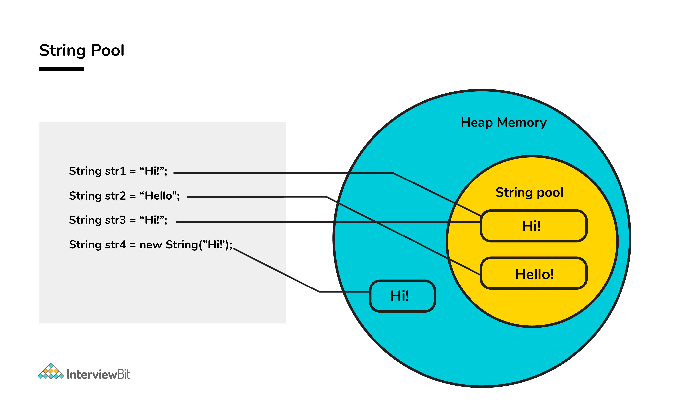
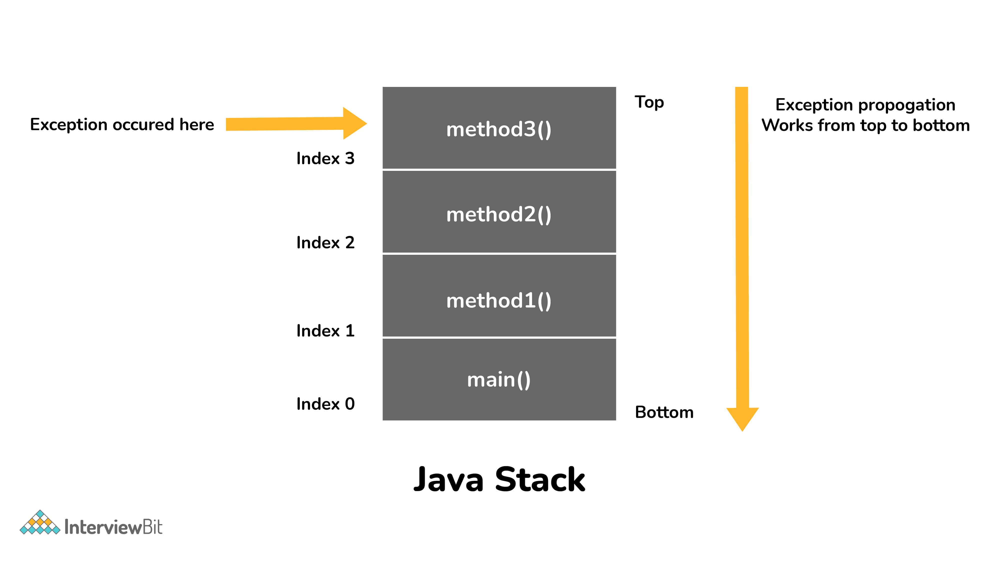
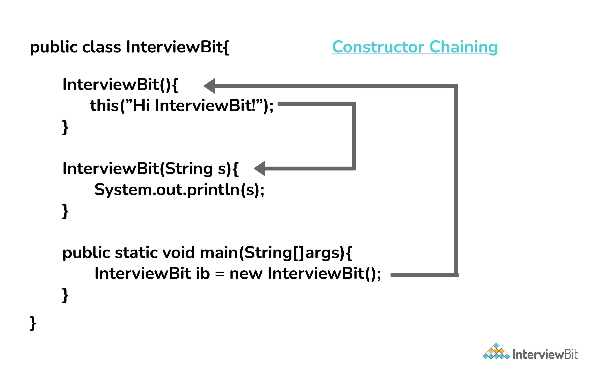
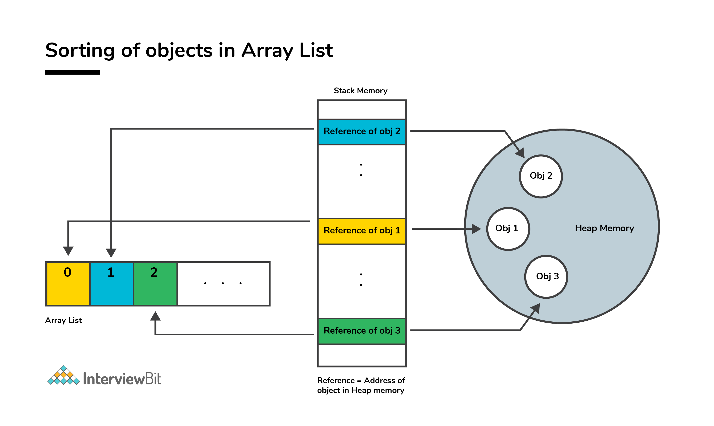

### Java Intermediate Interview Questions

#### 1. Apart from the security aspect, what are the reasons behind making strings immutable in Java?

A String is made immutable due to the following reasons:
<br><b>String Pool</b>:
Designers of Java were aware of the fact that String data type is going to be majorly used by the programmers and
developers. Thus, they wanted optimization from the beginning. They came up with the notion of using the String pool (a
storage area in Java heap) to store the String literals. They intended to decrease the temporary String object with the
help of sharing. An immutable class is needed to facilitate sharing. The sharing of the mutable structures between two
unknown parties is not possible. Thus, immutable Java String helps in executing the concept of String Pool.

Multithreading: The safety of threads regarding the String objects is an important aspect in Java. No external
synchronization is required if the String objects are immutable. Thus, a cleaner code can be written for sharing the
String objects across different threads. The complex process of concurrency is facilitated by this method.

Collections: In the case of Hashtables and HashMaps, keys are String objects. If the String objects are not immutable,
then it can get modified during the period when it resides in the HashMaps. Consequently, the retrieval of the desired
data is not possible. Such changing states pose a lot of risks. Therefore, it is quite safe to make the string
immutable.


#### 2. How would you differentiate between a String, StringBuffer, and a StringBuilder?

Storage area: In string, the String pool serves as the storage area. For StringBuilder and StringBuffer, heap memory is
the storage area.

Mutability: A String is immutable, whereas both the StringBuilder and StringBuffer are mutable.

Efficiency: It is quite slow to work with a String. However, StringBuilder is the fastest in performing operations. The
speed of a StringBuffer is more than a String and less than a StringBuilder. (For example appending a character is
fastest in StringBuilder and very slow in String because a new memory is required for the new String with appended
character.)

Thread-safe: In the case of a threaded environment, StringBuilder and StringBuffer are used whereas a String is not
used. However, StringBuilder is suitable for an environment with a single thread, and a StringBuffer is suitable for
multiple threads.

Syntax:

```
// String

String first = "InterviewBit";

String second = new String("InterviewBit");

// StringBuffer

StringBuffer third = new StringBuffer("InterviewBit");

// StringBuilder

StringBuilder fourth = new StringBuilder("InterviewBit");
```

#### 2. Using relevant properties highlight the differences between interfaces and abstract classes.

Availability of methods: Only abstract methods are available in interfaces, whereas non-abstract methods can be present
along with abstract methods in abstract classes.

Variable types: Static and final variables can only be declared in the case of interfaces, whereas abstract classes can
also have non-static and non-final variables.

Inheritance: Multiple inheritances are facilitated by interfaces, whereas abstract classes do not promote multiple
inheritances.

Data member accessibility: By default, the class data members of interfaces are of the public- type. Conversely, the
class members for an abstract class can be protected or private also.

Implementation: With the help of an abstract class, the implementation of an interface is easily possible. However, the
converse is not true;

Abstract class example:

```
public abstract class Athlete {
public abstract void walk();
}
Interface example:

public interface Walkable {
void walk();
}
```

#### 3. In Java, static as well as private method overriding is possible. Comment on the statement.

The statement in the context is completely False. The static methods have no relevance with the objects, and these
methods are of the class level. In the case of a child class, a static method with a method signature exactly like that
of the parent class can exist without even throwing any compilation error.

The phenomenon mentioned here is popularly known as method hiding, and overriding is certainly not possible. Private
method overriding is unimaginable because the visibility of the private method is restricted to the parent class only.
As a result, only hiding can be facilitated and not overriding.

#### 4. What makes a HashSet different from a TreeSet?

Although both HashSet and TreeSet are not synchronized and ensure that duplicates are not present, there are certain
properties that distinguish a HashSet from a TreeSet.

Implementation: For a HashSet, the hash table is utilized for storing the elements in an unordered manner. However,
TreeSet makes use of the red-black tree to store the elements in a sorted manner.

Complexity/ Performance: For adding, retrieving, and deleting elements, the time amortized complexity is O(1) for a
HashSet. The time complexity for performing the same operations is a bit higher for TreeSet and is equal to O(log n).
Overall, the performance of HashSet is faster in comparison to TreeSet.

Methods: hashCode() and equals() are the methods utilized by HashSet for making comparisons between the objects.
Conversely, compareTo() and compare() methods are utilized by TreeSet to facilitate object comparisons.

Objects type: Heterogeneous and null objects can be stored with the help of HashSet. In the case of a TreeSet, runtime
exception occurs while inserting heterogeneous objects or null objects.

#### 5. Why is the character array preferred over string for storing confidential information?

In Java, a string is basically immutable i.e. it cannot be modified. After its declaration, it continues to stay in the
string pool as long as it is not removed in the form of garbage. In other words, a string resides in the heap section of
the memory for an unregulated and unspecified time interval after string value processing is executed.

As a result, vital information can be stolen for pursuing harmful activities by hackers if a memory dump is illegally
accessed by them. Such risks can be eliminated by using mutable objects or structures like character arrays for storing
any variable. After the work of the character array variable is done, the variable can be configured to blank at the
same instant. Consequently, it helps in saving heap memory and also gives no chance to the hackers to extract vital
data.

#### 6. What are the differences between JVM, JRE and JDK in Java?

JDK = (JRE) + Development tools JRE = (JVM) + Libraries to execute the application JVM = Runtime environment to execute
Java byte code.

#### 7. What are the differences between HashMap and HashTable in Java?

HashMap HashTable HashMap is not synchronized thereby making it better for non-threaded applications. HashTable is
synchronized and hence it is suitable for threaded applications. Allows only one null key but any number of null in the
values. This does not allow null in both keys or values. Supports order of insertion by making use of its subclass
LinkedHashMap. Order of insertion is not guaranteed in HashTable.

#### 8. What is the importance of reflection in Java?

The term reflection is used for describing the inspection capability of a code on other code either of itself or of its
system and modify it during runtime. Consider an example where we have an object of unknown type and we have a method
‘fooBar()’ which we need to call on the object. The static typing system of Java doesn't allow this method invocation
unless the type of the object is known beforehand. This can be achieved using reflection which allows the code to scan
the object and identify if it has any method called “fooBar()” and only then call the method if needed.

    Method methodOfFoo = fooObject.getClass().getMethod("fooBar", null);
    methodOfFoo.invoke(fooObject, null);

Using reflection has its own cons:
Speed — Method invocations due to reflection are about three times slower than the direct method calls. Type safety —
When a method is invoked via its reference wrongly using reflection, invocation fails at runtime as it is not detected
at compile/load time. Traceability — Whenever a reflective method fails, it is very difficult to find the root cause of
this failure due to a huge stack trace. One has to deep dive into the invoke() and proxy() method logs to identify the
root cause. Hence, it is advisable to follow solutions that don't involve reflection and use this method as a last
resort.

#### 9. What are the different ways of threads usage?

We can define and implement a thread in java using two ways:

Extending the Thread class

```    
class InterviewBitThreadExample extends Thread{  
    public void run(){  
    System.out.println("Thread runs...");  
    }  
    public static void main(String args[]){  
    InterviewBitThreadExample ib = new InterviewBitThreadExample();  
    ib.start();  
    }  
    }
    Implementing the Runnable interface
    class InterviewBitThreadExample implements Runnable{  
    public void run(){  
    System.out.println("Thread runs...");  
    }  
    public static void main(String args[]){  
    Thread ib = new Thread(new InterviewBitThreadExample());
    ib.start();  
    }  
    }
```

Implementing a thread using the method of Runnable interface is more preferred and advantageous as Java does not have
support for multiple inheritances of classes.

start() method is used for creating a separate call stack for the thread execution. Once the call stack is created, JVM
calls the run() method for executing the thread in that call stack.

#### 10. What are the differences between constructor and method of a class in Java?

Constructor Method

Constructor is used for initializing the object state. Method is used for exposing the object's behavior.

Constructor has no return type. Method should have a return type. Even if it does not return anything, return type is
void.

Constructor gets invoked implicitly. Method has to be invoked on the object explicitly.

If the constructor is not defined, then a default constructor is provided by the java compiler. If a method is not
defined, then the compiler does not provide it.

The constructor name should be equal to the class name. The name of the method can have any name or have a class name
too.

A constructor cannot be marked as final because whenever a class is inherited, the constructors are not inherited.
Hence, marking it final doesn't make sense. Java throws compilation error saying - modifier final not allowed here A
method can be defined as final but it cannot be overridden in its subclasses.

Final variable instantiations are possible inside a constructor and the scope of this applies to the whole class and its
objects. A final variable if initialised inside a method ensures that the variable cant be changed only within the scope
of that method.

#### 11. Java works as “pass by value” or “pass by reference” phenomenon?

Java always works as a “pass by value”. There is nothing called a “pass by reference” in Java. However, when the object
is passed in any method, the address of the value is passed due to the nature of object handling in Java. When an object
is passed, a copy of the reference is created by Java and that is passed to the method. The objects point to the same
memory location. 2 cases might happen inside the method:

Case 1: When the object is pointed to another location: In this case, the changes made to that object do not get
reflected the original object before it was passed to the method as the reference points to another location. For
example:

```
class InterviewBitTest{
int num;
InterviewBitTest(int x){
num = x;
}
InterviewBitTest(){
num = 0;
}
}
class Driver {
public static void main(String[] args)
{
//create a reference
InterviewBitTest ibTestObj = new InterviewBitTest(20);
//Pass the reference to updateObject Method
updateObject(ibTestObj);
//After the updateObject is executed, check for the value of num in the object.
System.out.println(ibTestObj.num);
}
public static void updateObject(InterviewBitTest ibObj)
{
// Point the object to new reference
ibObj = new InterviewBitTest();
// Update the value
ibObj.num = 50;
}
}
Output:
20
```

Case 2: When object references are not modified: In this case, since we have the copy of reference the main object
pointing to the same memory location, any changes in the content of the object get reflected in the original object. For
example:

```
class InterviewBitTest{
int num;
InterviewBitTest(int x){
num = x;
}
InterviewBitTest(){
num = 0;
}
}
class Driver{
public static void main(String[] args)
{
//create a reference
InterviewBitTest ibTestObj = new InterviewBitTest(20);
//Pass the reference to updateObject Method
updateObject(ibTestObj);
//After the updateObject is executed, check for the value of num in the object.
System.out.println(ibTestObj.num);
}
public static void updateObject(InterviewBitTest ibObj)
{
// no changes are made to point the ibObj to new location
// Update the value of num
ibObj.num = 50;
}
}
Output:
50
```

#### 12. Which among String or String Buffer should be preferred when there are lot of updates required to be done in the data?

StringBuffer is mutable and dynamic in nature whereas String is immutable. Every updation / modification of String
creates a new String thereby overloading the string pool with unnecessary objects. Hence, in the cases of a lot of
updates, it is always preferred to use StringBuffer as it will reduce the overhead of the creation of multiple String
objects in the string pool.

#### 13. How to not allow serialization of attributes of a class in Java?

In order to achieve this, the attribute can be declared along with the usage of transient keyword as shown below:

```
public class InterviewBitExample {

private transient String someInfo;
private String name;
private int id;
// :
// Getters setters
// :
}
```

In the above example, all the fields except someInfo can be serialized.

#### 14. What happens if the static modifier is not included in the main method signature in Java?

There wouldn't be any compilation error. But then the program is run, since the JVM cant map the main method signature,
the code throws “NoSuchMethodError” error at the runtime.

#### 15. What happens if there are multiple main methods inside one class in Java?

The program can't compile as the compiler says that the method has been already defined inside the class.

#### 16. What do you understand by Object Cloning and how do you achieve it in Java?

    It is the process of creating an exact copy of any object. In order to support this, a java class has to implement the Cloneable interface of java.lang package and override the clone() method provided by the Object class the syntax of which is:

```    
protected Object clone() throws CloneNotSupportedException{
    return (Object)super.clone();
    }
```

In case the Cloneable interface is not implemented and just the method is overridden, it results in
CloneNotSupportedException in Java.

#### 17. How does an exception propagate in the code?

When an exception occurs, first it searches to locate the matching catch block. In case, the matching catch block is
located, then that block would be executed. Else, the exception propagates through the method call stack and goes into
the caller method where the process of matching the catch block is performed. This propagation happens until the
matching catch block is found. If the match is not found, then the program gets terminated in the main method.


#### 18. Is it mandatory for a catch block to be followed after a try block?

No, it is not necessary for a catch block to be present after a try block. - A try block should be followed either by a
catch block or by a finally block. If the exceptions likelihood is more, then they should be declared using the throws
clause of the method.

#### 19. Will the finally block get executed when the return statement is written at the end of try block and catch block as shown below?

```    
public int someMethod(int i){
    try{
    //some statement
    return 1;
    }catch(Exception e){
    //some statement
    return 999;
    }finally{
    //finally block statements
    }
    }
```

finally block will be executed irrespective of the exception or not. The only case where finally block is not executed
is when it encounters ‘System.exit()’ method anywhere in try/catch block.

#### 20. Can you call a constructor of a class inside the another constructor?

Yes, the concept can be termed as constructor chaining and can be achieved using this().

#### 21. Contiguous memory locations are usually used for storing actual values in an array but not in ArrayList. Explain.

In the case of ArrayList, data storing in the form of primitive data types (like int, float, etc.) is not possible. 

The data members/objects present in the ArrayList have references to the objects which are located at various sites in the
memory. 

Thus, storing of actual objects or non-primitive data types (like Integer, Double, etc.) takes place in various
memory locations.

However, the same does not apply to the arrays. Object or primitive type values can be stored in arrays in contiguous
memory locations, hence every element does not require any reference to the next element.

